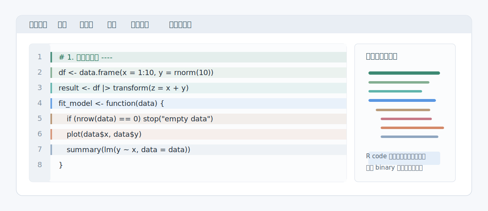
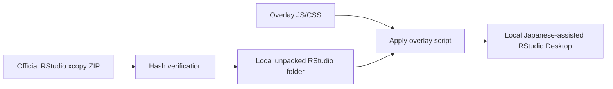

# Japanese Overlay for RStudio Desktop

<p align="center">
  
</p>

<p align="center">
  <a href="LICENSE"></a>
  
  
</p>

RStudio Desktop を日本語環境で読みやすくするための、非公式 Windows 向け overlay です。

この repository は RStudio Desktop 本体を配布しません。利用者の PC 上で公式 Windows xcopy build を取得し、SHA256 を確認してから、軽量な JavaScript / CSS / PowerShell scripts を重ねます。

> This project is unofficial. It is not endorsed by, sponsored by, or affiliated with Posit Software, PBC.

## 何が変わるか

| 領域 | 追加される補助 |
| --- | --- |
| UI labels | よく見える範囲の RStudio UI ラベルを日本語化 |
| Source editor | Ace editor 右側にコード構造ミニマップを追加 |
| R readability | 関数、制御構文、パイプ、データ処理、可視化、出力、guard 処理を行単位で淡く色分け |
| Structure | `()` / `[]` / `{}` のネスト深度を背景ガイドで表示 |
| Diagnostics | Ace diagnostics の warning / error 行を見つけやすく表示 |
| Updates | 公式 RStudio Daily build の更新確認と overlay 再適用 |

## 使い方

PowerShell で実行します。

```powershell
git clone https://github.com/light-suzuki/Rsutudio-Japanese.git
cd Rsutudio-Japanese

powershell -ExecutionPolicy Bypass -File .\scripts\install-rstudio-jp-desktop.ps1
powershell -ExecutionPolicy Bypass -File .\scripts\start-rstudio-jp-desktop.ps1
```

初回セットアップで行うこと:

1. 公式 RStudio Daily index から Windows xcopy build 情報を取得
2. 公式 ZIP を `output/rstudio-jp-install/` に download
3. SHA256 を確認
4. `rstudio-jp-desktop/` に展開済み RStudio を作成
5. `overlays/rstudio-jp/` の JavaScript / CSS を適用

## 更新

更新確認:

```powershell
powershell -ExecutionPolicy Bypass -File .\scripts\check-rstudio-jp-upstream.ps1
```

起動 script は、既にアプリが開いている場合は既存ウィンドウを前面に出します。開いていない場合は更新確認後に起動します。

```powershell
powershell -ExecutionPolicy Bypass -File .\scripts\start-rstudio-jp-desktop.ps1
```

更新確認を飛ばして起動:

```powershell
powershell -ExecutionPolicy Bypass -File .\scripts\start-rstudio-jp-desktop.ps1 -SkipUpdate
```

## 手動適用

既に公式 RStudio xcopy folder を展開済みの場合:

```powershell
powershell -ExecutionPolicy Bypass -File .\scripts\apply-rstudio-jp-overlay.ps1 `
  -BaseRoot "C:\path\to\official\RStudio" `
  -TargetRoot ".\rstudio-jp-desktop" `
  -Force
```

`-Force` は `rstudio-jp-desktop/` などの既知生成物、または overlay manifest を持つ target だけを削除対象にします。任意のフォルダを無条件に消す用途には使えません。

## 公開物に含めないもの

この repository は以下を含めません。

- RStudio Desktop 本体
- 公式 RStudio ZIP
- `exe` / `dll` / `pdb` などの binary
- Posit / RStudio のロゴ、アイコン、商標素材
- 個人環境の設定、ログ、作業データ

生成物は `.gitignore` で除外しています。

```text
rstudio-jp-desktop/
rstudio-jp-state/
output/
*.exe
*.dll
*.zip
*.ico
*.png
```

## 仕組み



主な overlay files:

- `overlays/rstudio-jp/resources/app/www/jp-customize.js`
- `overlays/rstudio-jp/resources/app/www/jp-customize.css`
- `overlays/rstudio-jp/jp-overlay-manifest.json`

主な scripts:

- `scripts/install-rstudio-jp-desktop.ps1`
- `scripts/apply-rstudio-jp-overlay.ps1`
- `scripts/check-rstudio-jp-upstream.ps1`
- `scripts/start-rstudio-jp-desktop.ps1`

## 制限

- RStudio Desktop 本体の完全な翻訳ではありません。
- Electron/GWT 側の深い menu 置換や本体改造は避けています。
- RStudio 側 DOM や Ace editor 構造が変わると、overlay の一部が効かなくなる可能性があります。
- Windows xcopy build を前提にしています。

## Troubleshooting

### download が遅い

公式 RStudio ZIP は大きいので、初回 download には時間がかかります。途中で止めた場合は、`output/rstudio-jp-install/` の不完全な ZIP を削除して再実行してください。

### 起動しない

まず setup 状態を確認します。

```powershell
powershell -ExecutionPolicy Bypass -File .\scripts\start-rstudio-jp-desktop.ps1 -NoLaunch -SkipUpdate
```

### overlay を再適用したい

```powershell
powershell -ExecutionPolicy Bypass -File .\scripts\install-rstudio-jp-desktop.ps1 -Force -NoLaunch
```

## 権利とライセンス

- この repository 内の overlay code と scripts は [MIT License](LICENSE) です。
- RStudio Desktop は Posit Software, PBC の製品で、RStudio 側の license に従います。
- RStudio upstream repository と Posit Support は、RStudio IDE が AGPLv3 で提供されていることを説明しています。
- Posit / RStudio の商標・ロゴは copyright license とは別扱いです。
- この repository は公式 binary や logo を再配布せず、公式 download 元から利用者のローカル環境に取得する方式にしています。

詳しくは [NOTICE](NOTICE) と [docs/LEGAL_NOTES.md](docs/LEGAL_NOTES.md) を見てください。

## 開発者向け checklist

公開前の確認:

```powershell
git status -sb
git ls-files | Select-String -Pattern '\.(exe|dll|zip|ico|png|pdb|log)$'
node --check .\overlays\rstudio-jp\resources\app\www\jp-customize.js
powershell -ExecutionPolicy Bypass -File .\scripts\install-rstudio-jp-desktop.ps1 -NoLaunch -Force
```

詳しくは [docs/PUBLISHING_CHECKLIST.md](docs/PUBLISHING_CHECKLIST.md) を参照してください。

## English Summary

Japanese Overlay for RStudio Desktop is an unofficial Windows overlay that adds Japanese UI assistance and editor readability aids to a local RStudio Desktop install.

It does not redistribute RStudio Desktop, Posit binaries, official archives, logos, or trademarks. The setup script downloads an official Windows xcopy build locally, verifies its SHA256 hash, and applies this repository's JavaScript/CSS overlay on the user's machine.

## Credits

- Idea and direction: light-suzuki
- Implementation support: OpenAI Codex / GPT models
- RStudio Desktop: Posit Software, PBC
